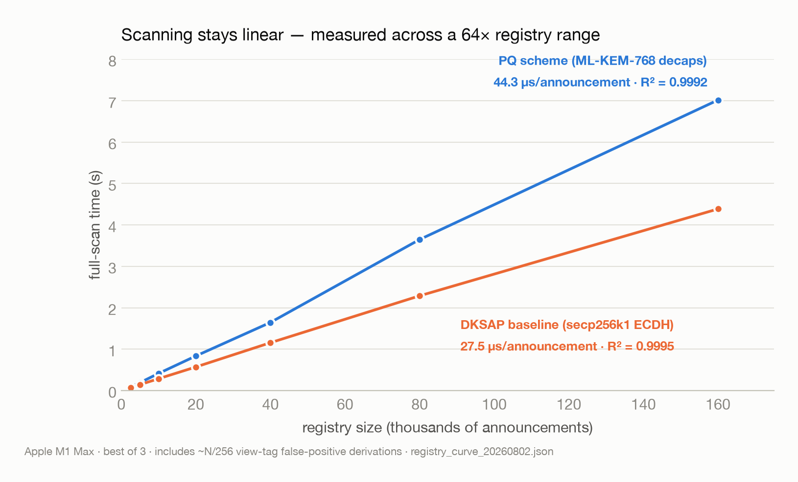
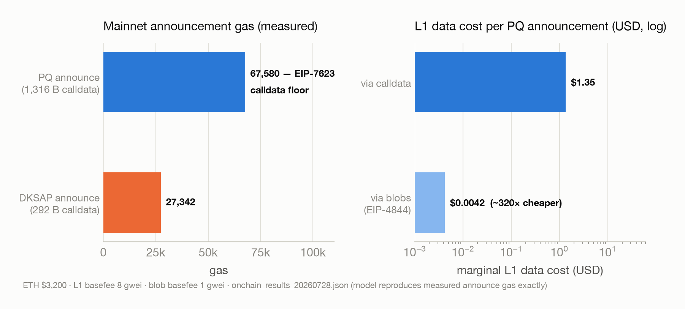
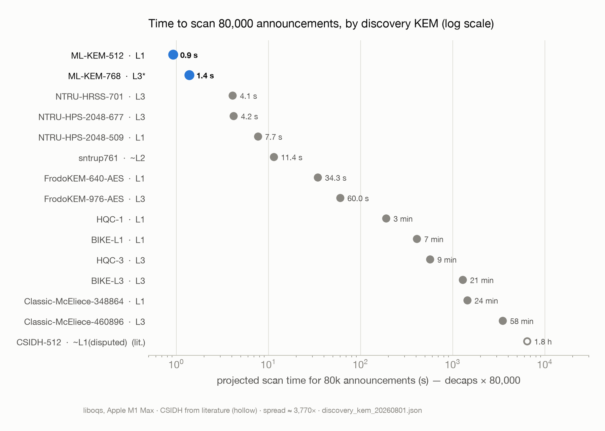
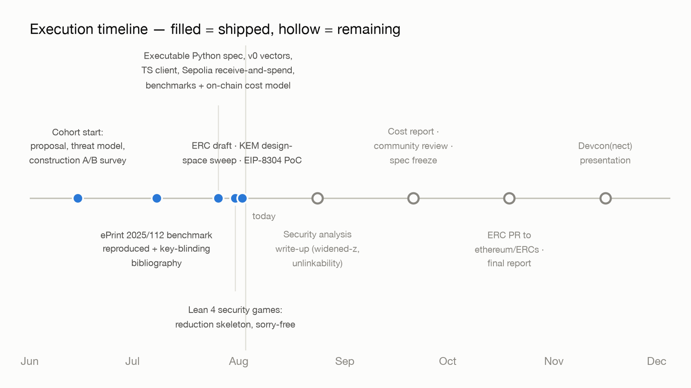

<!-- _paginate: false -->

# Post-Quantum Stealth Addresses

## an ERC-5564 scheme extension

**Ethereum Protocol Fellowship 2026 — project summary**

Fellow: **Skas** · Mentor: [Tamaghna](https://github.com/RazorClient)

---

## Stealth addresses: private payments on a public ledger

- You publish **one** handle (a *meta-address*, e.g. via ENS).
- Every sender derives a **fresh one-time address** from it — payments to you never link to your name or to each other.
- Already deployed and widely used on Ethereum: **ERC-5564** powers Fluidkey, Umbra, Cloaked.
- Much cheaper and simpler than heavy privacy systems — privacy through *unlinkability*, with normal accounts.

---

## The problem: harvest now, decrypt later

- Every stealth payment leaves a **public, permanent announcement** on-chain.
- Today's cryptography (elliptic curves) falls to a future quantum computer running Shor's algorithm — recorded announcements can be decoded **retroactively**, revealing who paid whom, forever.
- Ethereum's PQ roadmap makes the priority clear: quantum threatens **confidentiality before ownership** — funds migrate when the threat arrives, but privacy being harvested *today* is already lost.

**Privacy migration is more urgent than signature migration.**

---

## What this project delivers

A **post-quantum stealth address scheme** as a new ERC-5564 scheme ID:

- **Drop-in**: works against the already-deployed ERC-5564 / ERC-6538 contracts — no protocol change.
- **Discovery** (the urgent part) uses **ML-KEM-768**, NIST's standardized lattice KEM.
- **Spending** stays future-proof: derived keys sign under stock FIPS 204 verifiers, with a zero-knowledge ownership proof as the cheaper path.

Deliverables: ERC draft · conformance vectors · reference library · security analysis · benchmarks & cost report.

---

## How it works, in one slide

```text
Recipient   publish meta-address (PQ keys)          — once, via ENS / registry
Sender      encapsulate → shared secret S
            derive one-time stealth address from S  — sender never sees a secret key
            announce(ciphertext, view tag)
Recipient   scan announcements; a 1-byte view tag
            rejects ~255/256 instantly; match ⇒ payment found
Spend       one-time key signs (or proves ownership in ZK)
```

Same viewing/spending separation as today's schemes: a viewing key can *watch* payments, never spend them.

---

## Status: the engineering is done

- **Executable spec** (Python) + versioned **conformance vectors**, negative cases included
- **TypeScript scanning client** — matches the vectors *byte-for-byte*, scans real logs
- **Machine-checked security core** (Lean 4): correctness *and* the security-game reductions, no `sorry`s
- **ZK ownership proof** prototype (Noir) and a **live receive-and-spend on Sepolia** through the real contracts
- **ERC draft written**; benchmarks and on-chain costs measured

What remains is the part that gates the ERC: the **security write-up** and community review.

---

## Scanning stays practical



**1.6×** the deployed elliptic-curve baseline — linear across a 64× range, ~44 s per million announcements.

---

## Costs are about data, not computation



2.5× today's announcement gas on L1 — and **sub-cent on L2s with blobs**, which dissolves the size tax.

---

## We measured the whole design space



**ML-KEM is the right default** (fastest to scan); NTRU is the one credible hedge; everything else costs minutes-to-hours per scan.

---

## Security: formally analyzed, honestly scoped

- Unlinkability turns out to rest on KEM **anonymity** — a *different* property than the standard IND-CCA everyone verifies. Identifying and formalizing that gap is the project's research contribution.
- The full reduction chain down to lattice assumptions (MLWE / MSIS) is **machine-checked in Lean 4**, instantiated on real ML-KEM.
- What's still open is stated plainly in the draft — the final write-up is the remaining core deliverable, with a standardized-operations fallback if the analysis demands it.

---

## Timeline of execution



The engineering landed early — including stretch goals (live testnet spend, ZK prototype, formal proofs).

---

## The roadmap I'll serve

**To close the cohort**
1. **Security analysis write-up** → the construction A/B verdict
2. **Community review** (ethereum-magicians thread) → spec freeze
3. **ERC PR** to `ethereum/ERCs` with a registered scheme ID + final report

**Beyond the cohort — where this plugs into the ecosystem**
- Reference libraries wallets can adopt against the frozen vectors
- **EIP-8304** WG: trustless light-client scanning (working PoC; view-tag index ≈ 256× bandwidth win)
- ZK proofs to cheapen spending · native PQ spend via **EIP-8141** · the recipient scheme Native-UTXO proposals presuppose

---

## Links

- **Repo `erc-5567`**: spec, vectors, clients, proofs, benchmarks — everything public
- **ERC draft**: `docs/erc-draft.md` · decisions log: `docs/DECISIONS.md`
- Write-ups: [machine-checked security games](https://claude.ai/code/artifact/efa33122-e029-4cc6-a3c4-5b28076d2ed4) · [the KEM design space, measured](https://claude.ai/code/artifact/ccbbf9df-498f-4228-bec0-0a79d0f67116)
- Base paper: [ePrint 2025/112](https://eprint.iacr.org/2025/112) · Standards: [ERC-5564](https://eips.ethereum.org/EIPS/eip-5564), [ERC-6538](https://eips.ethereum.org/EIPS/eip-6538), FIPS 203/204

*Weekly dev updates per EPF process — figures regenerate from measured data: `docs/presentation/make_figs.py`*
