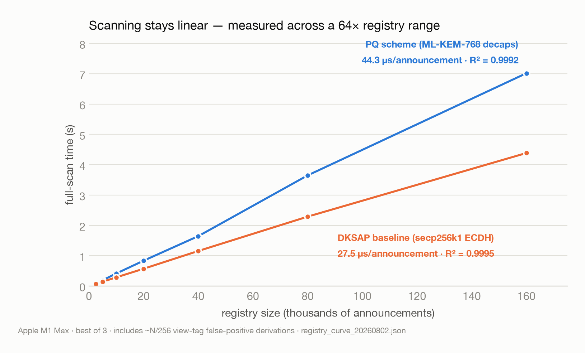
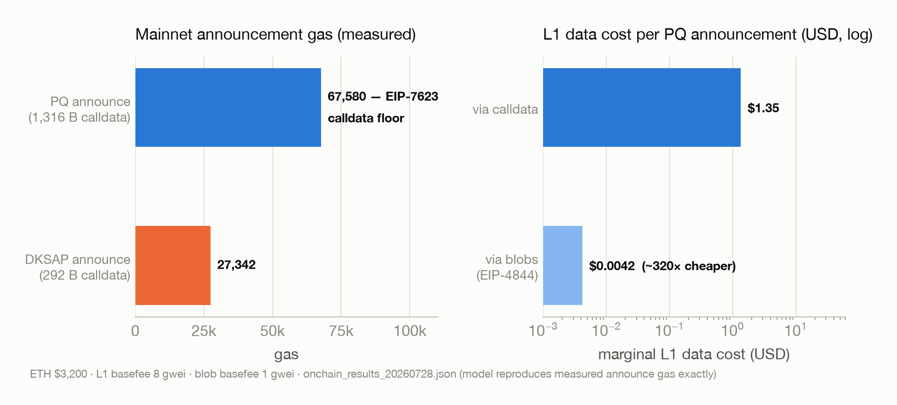
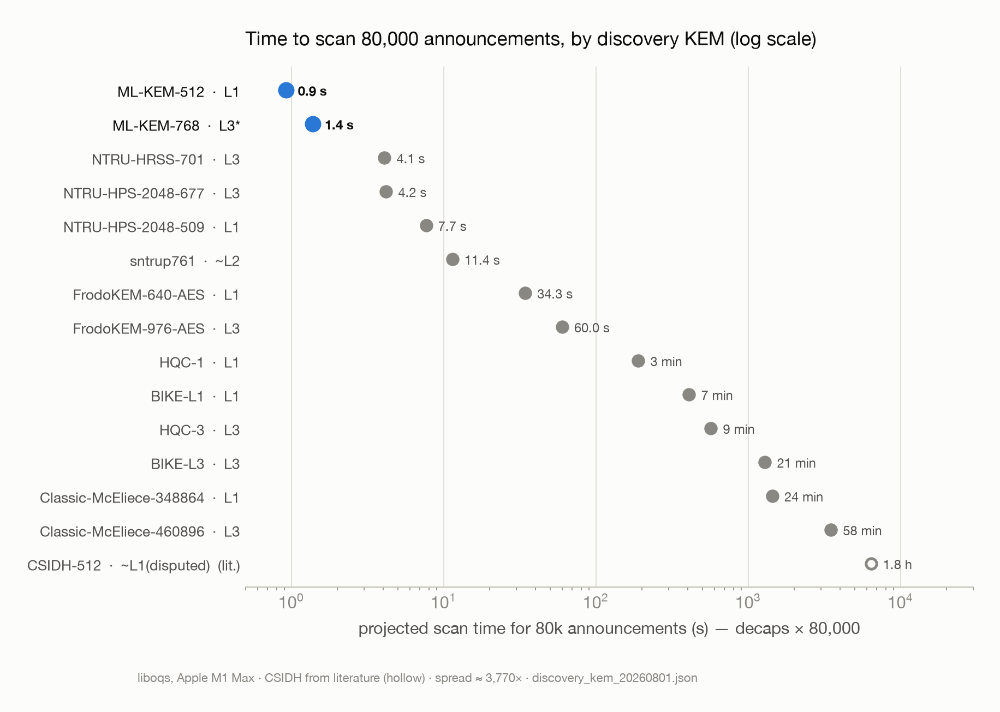
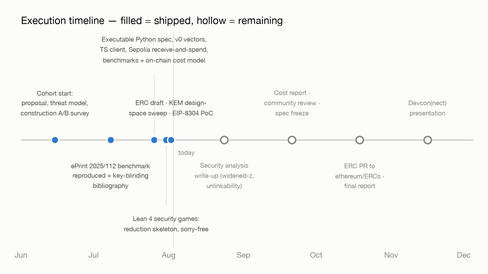

<!-- _paginate: false -->

# Post-Quantum Stealth Addresses

## an ERC-5564 scheme extension

**Ethereum Protocol Fellowship 2026 — project summary**

Fellow: **Skas** · Mentor: [Tamaghna](https://github.com/RazorClient)

---

## Stealth addresses: private payments on a public ledger

- You publish **one** handle (a *meta-address*, e.g. via ENS).
- Every sender derives a **fresh one-time address** from it — intended to conceal the recipient relationship; spending and metadata can still create links.
- Already deployed and widely used on Ethereum: **ERC-5564** powers Fluidkey, Umbra, Cloaked.
- Much cheaper and simpler than heavy privacy systems — privacy through *unlinkability*, with normal accounts.

---

## The problem: harvest now, decrypt later

- Every stealth payment leaves a **public, permanent announcement** on-chain.
- Today's cryptography (elliptic curves) falls to a future quantum computer running Shor's algorithm — recorded announcements can be decoded **retroactively**, revealing who paid whom, forever.
- Ethereum's PQ roadmap makes the priority clear: quantum threatens **confidentiality before ownership** — funds migrate when the threat arrives, but privacy being harvested *today* is already lost.

**Privacy migration is more urgent than signature migration.**

---

## What this project delivers

A **post-quantum stealth address scheme** as a new ERC-5564 scheme ID:

- **Drop-in**: works against the already-deployed ERC-5564 / ERC-6538 contracts — no protocol change.
- **Discovery** (the urgent part) uses **ML-KEM-768**, NIST's standardized lattice KEM.
- **Address derivation** uses a 1,217-byte commitment meta-address (D-024); spending is delegated to the account model.
- **Browser demo** proves ownership of a secret (D-025); its current proof backend is not post-quantum sound.

Evidence: conformance vectors · Python/TS libraries · scoped Lean results · security analysis · measured demos.

Next deliverable: reviewer asset package and human-written ERC text.

Key-exchange evidence: `docs/ERC_EVIDENCE.md`. Spending proofs and Lean tooling are separate supporting tracks.

---

## How it works, in one slide

```text
Recipient   publish spend commitment + KEM viewing key
            as a meta-address via ENS / registry
Sender      encapsulate → shared secret S
            derive one-time stealth address from S  — sender never sees a secret key
            announce(ciphertext, view tag)
Recipient   decapsulate each candidate; compare 1-byte view tag
            reject mismatches; re-derive address on tag match
Spend       account verifies its chosen authorization mechanism
```

Same viewing/spending separation as today's schemes: a viewing key can *watch* payments, never spend them.

---

## Status: implemented evidence, review still ahead

- **Executable spec** (Python) + versioned **conformance vectors**, negative cases included
- **TypeScript scanning client** — matches the vectors *byte-for-byte*, scans real logs
- **Machine-checked Construction A core** (Lean 4): correctness and scoped security-game reductions under explicit assumptions
- **Browser preimage-ownership demo** and recorded receive/spend evidence on the frames testnet (D-025)
- **Commitment format implemented and vectored**; Construction A retained as another address form

Next: security review by route, a dependency-free vector checker, asset packaging, and community discussion. ERC text remains human-written and pre-freeze.

---

## Scanning stays practical



**1.6×** the deployed elliptic-curve baseline — linear across a 64× range, ~44 s per million announcements.

---

## Costs are about data, not computation



Historical announcement benchmark; costs depend on network pricing and data publication.

Report registration, announcements, and spending separately; D-024 reduces the meta-address from 5,633 to 1,217 bytes.

---

## We measured the whole design space



**ML-KEM is the right default** (fastest to scan); NTRU is the one credible hedge; everything else costs minutes-to-hours per scan.

---

## Security: formally analyzed, honestly scoped

- Unlinkability turns out to rest on KEM **anonymity** — a *different* property than the standard IND-CCA everyone verifies. Identifying and formalizing that gap is the project's research contribution.
- Construction A has machine-checked structural reductions, including an address-hash ROM query bound, with named assumptions.
- Related-key ownership-witness security does not complete signature EUF-CMA security; the signature layer remains uncomposed.
- Active ANO-CCA mapping and quantum random-oracle access are outside the established result. Commitment accounts and their proof backends need separate review. See `docs/ERC_EVIDENCE.md`; detailed Construction A results are supporting research.

---

## Timeline of execution



The engineering landed early — including stretch goals (live testnet spend, ZK prototype, formal proofs).

---

## The roadmap I'll serve

**To close the cohort**

1. **Reviewer package** → commitment vectors, checker coverage, security boundaries
2. **Community review** → human-written ERC text and format decisions
3. **ERC submission** → self-contained assets and locally validated package

**Beyond the cohort — where this plugs into the ecosystem**

- Reference libraries wallets can adopt against the frozen vectors
- **EIP-8304** WG: trustless light-client scanning (working PoC; view-tag index ≈ 256× bandwidth win)
- Account-based spending experiments; evaluate **EIP-8288** aggregation as a prospective route
- See `docs/research/eip-8288-summary.md`: integration work, privacy boundaries, and proposed versus measured costs

---

## Links

- **Repo `pq-sap`**: spec, vectors, clients, proofs, benchmarks — everything public
- **ERC draft**: `docs/erc-draft.md` · decisions log: `docs/DECISIONS.md` · technical spec: `docs/TECHNICAL_SPEC.md`
- Write-ups: machine-checked security games (`lean/docs/spr-two-hop.md`) · the KEM design space, measured (`python/benchmarks/README.md`)
- Base paper: [ePrint 2025/112](https://eprint.iacr.org/2025/112) · Standards: [ERC-5564](https://eips.ethereum.org/EIPS/eip-5564), [ERC-6538](https://eips.ethereum.org/EIPS/eip-6538), FIPS 203/204

*Weekly dev updates per EPF process — figures regenerate from measured data: `docs/presentation/make_figs.py`*
